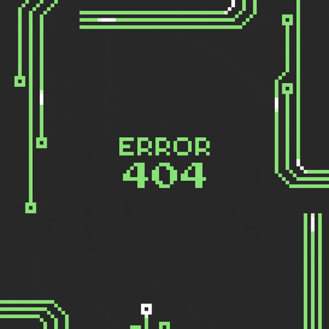

  

  Computer Science Student • Designer • Fullstack Developer in progress

  Currently studying JavaScript, TypeScript, React and Go, seeking diverse technical experiences to expand my foundation as a developer — from learning new languages to challenge myself to exploring different technologies, paradigms and ways of building software.

  I'm driven by continuous learning and constant evolution, transforming ideas into real solutions — from concept to implementation.

  I enjoy challenges, stepping out of my comfort zone and learning by doing: experimenting, making mistakes, refactoring and improving with every project.

  I have a strong desire to grow in the technology field, not only as a programmer, but as someone who builds complete, scalable and well-designed solutions, regardless of the stack.

---

<h3 align="left">Entre em contato comigo!</h3>

---

<h3 align="left">My Stack</h3>

  
  
  
  
  
  
  
  
  
  
  
  
  
  
  

---

<h3 align="left">Currently Learning</h3>

- Backend development with Go
- Rust fundamentals
- APIs and distributed systems
- System-level programming concepts
- Building developer tools

---

<h3 align="left">Featured Projects</h3>

🚀 **justke-cli** — A terminal-based portfolio built as a CLI application to explore Go and terminal interfaces.

🖥️ **justke-os** — Experimental portfolio distributed as an ISO image to explore low-level programming and system concepts.

💼 **Ketsu Projects** — Real-world development projects built together with my colleague, focused on delivering solutions for real clients.

🤖 **Reboot** — Arduino robot created for experimentation and learning electronics and embedded programming.

📚 **Aprendizado** — Repository where I document my programming studies, exercises and experiments across multiple languages.

---

<h3 align="center">GitHub Stats</h3>

<!-- Linha 1: User + Top Languages -->

  
  &nbsp;&nbsp;
  

 

<!-- Linha 2: Recent Repos + Repo Card -->

  
  &nbsp;&nbsp;

---

<h3 align="center">Terminal</h3>

<!-- github-readme-terminal -->
<!-- Gere seu GIF em: https://github.com/x0rzavi/github-readme-terminal -->
<!-- Após gerar, substitua o src abaixo pelo link do seu GIF (ImgBB ou direto do repo) -->

  

---

<!-- Snake contribution grid -->
<picture align="center">
  <source media="(prefers-color-scheme: dark)" srcset="https://raw.githubusercontent.com/RichardtJustke/RichardtJustke/output/github-contribution-grid-snake-dark.svg">
  <source media="(prefers-color-scheme: light)" srcset="https://raw.githubusercontent.com/RichardtJustke/RichardtJustke/output/github-contribution-grid-snake-dark.svg">
  
</picture>
